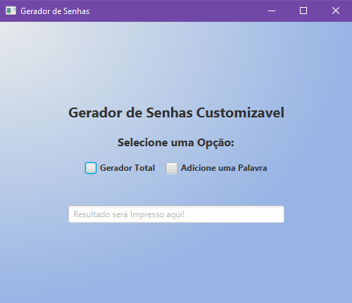

# 🔑 Gerador de Senhas Customizável 🔑

#### Autor: [Gabriel Perin](https://github.com/Gabriel-Perin99)
Um aplicativo desktop em **Java+JavaFX+CSS** que gera senhas de forma totalemente aleatória ou combbinando uma palavra escolhida pelo usuário com caracteres aleatórios.




***

## 🚀 Funcionalidades 🚀

- **Gerador Total**: Cria uma senha completamente aleatória com o número de caracteres que o usuário desejar (Max.20).
- **Gerador Parcial**: Combina uma palavra definida pelo usuário com caracteres aleatórios antes e depois dela!
- **Botão de Copiar**: Copia a senha ggerada para a área de transferência.
- **Interface simples e Intuitiva** feita com JavaFX e CSS.
***
## 🛠️ Tecnologias Utilizadas 🛠️

- [Java 21+](https://www.oracle.com/java/technologies/downloads/)
- [JavaFX](https://openjfx.io/)
- [Maven](https://maven.apache.org/) (para gerenciamento de dependências)
- CSS
***
## 👓 Como Executar 👓

### 1. Clonar o repositório:

```bash
    https://github.com/Gabriel-Perin99/Custom_Password_Generator.git
    cd Custom_Password_Generator
```

### 2. Instalar dependências:
Certifique-se de ter o Maven e o JavaFX Configurados:

```bash
    mvn clean install
```

### 3.Executar o Projeto:

```bash
    mvn javafx:run
```

### 4.Exetutando sem o Maven:
Existem maneiras de executar o projeto sem o gerenciamento do Maven, porem deverá ser feita toda a dependencia do javaFX de maneira manual:
***
#### Intellij IDE: 
- Selecione **Run > Edit Configuration > + Aplication**;  
- Selecione a classe **Generetor**;
- Clique em **modify options** e selecione **add MV option**
- Então no campo que abrir, cole o seguinte código:
``` bash
    --module-path CAMINHO-JAVASDK\lib --add-modules javafx.controls,javafx.fxml
```
**NOTA: Sera necessário indicar o caminho do SDK \ lib, basta subistituir e rodar normalmente.**
***

#### Visual Studio Code:
Para rodar no Vs Code sera necessário seguir os seguintes passos:

- Certifique-se de ter a extenção **Extension Pack for Java** instalada.
- Caso necessário, crie a pasta **.vscode** na raiz do projeto.
- Crie ou edite o arquivo **lauch.json** e cole o código abaixo:

``` bash
{
    "version": "0.2.0",
    "configurations": [
        {
            "type": "java",
            "name": "Gerar Senha (JavaFX)",
            "request": "launch",
            "mainClass": "com.github.GabrielPerin.Generator",
            "vmArgs": "--module-path CAMINHO-JAVASDK\lib --add-modules javafx.controls,javafx.fxml"
        }
    ]
}
```
**Assim como no Intellij, será necessário referenciar o caminho do SDK!**
***
